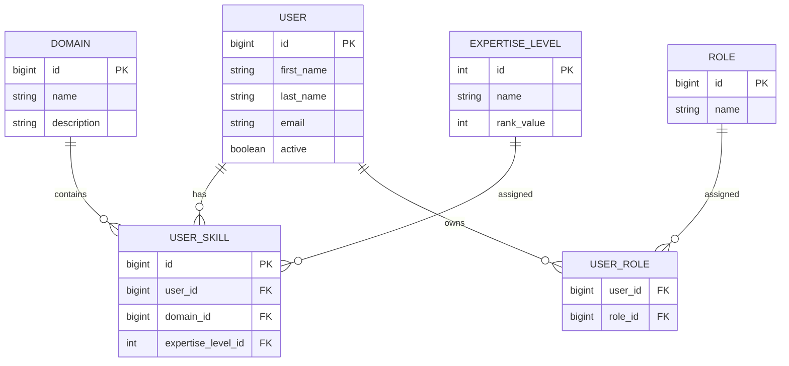

# ERD – Expert Management System

## Diagram ERD (Mermaid)

## Relacje

- User ↔ Role: wiele-do-wielu
- User ↔ UserSkill: jeden-do-wielu
- Domain ↔ UserSkill: jeden-do-wielu
- ExpertiseLevel ↔ UserSkill: jeden-do-wielu

## Przykładowe role

- ROLE_USER
- ROLE_ADMIN

## Przykładowe poziomy kompetencji

| Nazwa | Wartość |
|--------|----------|
| Awareness | 1 |
| Functional | 2 |
| Professional | 3 |
| Master | 4 |
